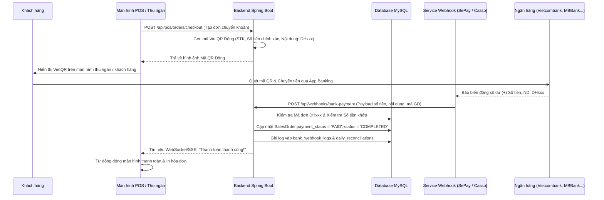
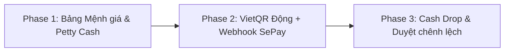

# Kế hoạch Thiết kế & Triển khai: Tự động Đối soát Ngân hàng (VietQR/Webhook) & Quản lý Két Nâng cao

Tài liệu này chi tiết hóa kế hoạch thiết kế giao diện (UI), cấu trúc CSDL (Database Schema), luồng xử lý Backend (BE) và lộ trình triển khai cho hai phân hệ trọng tâm:
1. **Hệ thống Tự động Đối soát Ngân hàng (VietQR Động + Bank Webhook)** - Chống fake bill 100%, không cần GPKD doanh nghiệp (sử dụng tài khoản ngân hàng cá nhân của chủ tiệm qua SePay/Casso).
2. **Hệ thống Quản lý Két Tiền mặt & Dòng tiền Nâng cao** - Đạt chuẩn nghiệp vụ chuỗi bán lẻ chuyên nghiệp (Bảng đếm mệnh giá chi tiết, Phiếu Thu/Chi lặt vặt Petty Cash, Rút tiền két về két an toàn Cash Drop, và Quy trình giải trình chênh lệch).

---

## 1. Phân hệ 1: Tự động Đối soát Ngân hàng (VietQR Dynamic & Bank Webhook)

### 1.1. Luồng Hoạt động (Architectural Flow)



### 1.2. Giải pháp Pháp lý & Chi phí
- **Không cần Giấy chứng nhận Hộ kinh doanh**: Chủ tiệm sử dụng tài khoản cá nhân ngân hàng chính chủ (MBBank, Vietcombank, Techcombank, ACB...).
- **Cổng kết nối Webhook**: Tích hợp với **SePay.vn** hoặc **Casso.vn**.
- **Phí giao dịch**: 0% (Không bị chiết khấu 1-2% như thanh toán thẻ). Chi phí cố định gói đối soát chỉ từ 99.000đ/tháng.

### 1.3. Cấu trúc CSDL bổ sung (`bank_webhook_logs`)

```sql
CREATE TABLE `bank_webhook_logs` (
  `id` bigint NOT NULL AUTO_INCREMENT,
  `gateway_provider` varchar(30) NOT NULL, -- e.g., 'SEPAY', 'CASSO'
  `transaction_reference` varchar(100) NOT NULL, -- Mã giao dịch ngân hàng (FTxxxx)
  `account_number` varchar(50) NOT NULL, -- Số tài khoản nhận
  `amount` decimal(15,2) NOT NULL, -- Số tiền chuyển về
  `content` text NOT NULL, -- Nội dung chuyển khoản (chứa mã đơn)
  `sales_order_code` varchar(50) DEFAULT NULL, -- Mã đơn hàng parse được (VD: DH041)
  `match_status` varchar(20) DEFAULT 'MATCHED', -- MATCHED, UNMATCHED, DUPLICATE
  `raw_payload` json DEFAULT NULL, -- Dữ liệu JSON thô từ Webhook
  `created_at` datetime(6) DEFAULT CURRENT_TIMESTAMP(6),
  PRIMARY KEY (`id`),
  KEY `idx_so_code` (`sales_order_code`),
  KEY `idx_trans_ref` (`transaction_reference`)
) ENGINE=InnoDB DEFAULT CHARSET=utf8mb4 COLLATE=utf8mb4_0900_ai_ci;
```

---

## 2. Phân hệ 2: Quản lý Két Tiền mặt & Dòng tiền Nâng cao

### 2.1. Trình kiểm đếm Mệnh giá tiền Chi tiết (Cash Denomination Counter)
Thu ngân khi chốt két sẽ không chỉ gõ con số tổng mà kiểm đếm số tờ cho từng mệnh giá tiền Việt Nam Đồng:
- Mệnh giá: `500.000đ`, `200.000đ`, `100.000đ`, `50.000đ`, `20.000đ`, `10.000đ`, `5.000đ`, `2.000đ`, `1.000đ`.
- Công thức: $\text{Tổng thực tế} = \sum (\text{Mệnh giá}_i \times \text{Số tờ}_i)$.

**Cấu trúc CSDL (`cash_denomination_counts`)**:
```sql
CREATE TABLE `cash_denomination_counts` (
  `id` bigint NOT NULL AUTO_INCREMENT,
  `reconciliation_id` int NOT NULL,
  `denomination_value` decimal(15,2) NOT NULL, -- e.g., 500000, 200000
  `sheet_count` int NOT NULL DEFAULT '0', -- Số lượng tờ
  `total_value` decimal(15,2) NOT NULL, -- denomination_value * sheet_count
  `created_at` datetime(6) DEFAULT CURRENT_TIMESTAMP(6),
  PRIMARY KEY (`id`),
  KEY `FK_denom_reconciliation` (`reconciliation_id`),
  CONSTRAINT `FK_denom_reconciliation` FOREIGN KEY (`reconciliation_id`) REFERENCES `daily_reconciliations` (`id`) ON DELETE CASCADE
) ENGINE=InnoDB DEFAULT CHARSET=utf8mb4 COLLATE=utf8mb4_0900_ai_ci;
```

---

### 2.2. Quản lý Phiếu Chi / Thu lặt vặt (Petty Cash Management)
Ghi nhận các khoản chi/thu không qua hóa đơn bán hàng để đảm bảo két lý thuyết luôn chuẩn xác:
- **Phiếu Chi (Cash Expense)**: Chi mua băng keo, chi nước uống quầy, chi trả ship COD, chi hoàn tiền mặt cho khách.
- **Phiếu Thu khác (Other Cash In)**: Nhập thêm tiền thối đầu ngày, thu bồi hoàn từ nhân viên.

**Cấu trúc CSDL bổ sung cho `petty_cash_transactions`**:
```sql
ALTER TABLE `petty_cash_transactions`
ADD COLUMN `voucher_code` varchar(30) NOT NULL AFTER `id`,
ADD COLUMN `payment_method` varchar(20) DEFAULT 'CASH',
ADD COLUMN `evidence_image_url` varchar(255) DEFAULT NULL;
```

---

### 2.3. Rút bớt tiền két về Két an toàn / Két chính (Cash Drop / Cash Skimming)
Tránh rủi ro tích tụ tiền mặt quá lớn tại quầy bán hàng bằng cơ chế tự động cảnh báo:
- **Hạn mức an toàn tại quầy**: Mặc định `5.000.000đ`.
- Khi tiền mặt tại quầy vượt hạn mức, hiển thị cảnh báo: *"Tiền mặt tại két đạt X đ. Vui lòng rút bớt tiền nộp Két an toàn!"*
- **Phiếu Rút Tiền Két (Cash Drop Voucher)**: Giảm tiền két quầy, ghi nhận tiền chuyển sang Két chính của Cửa hàng trưởng.

**Cấu trúc CSDL (`cash_drop_vouchers`)**:
```sql
CREATE TABLE `cash_drop_vouchers` (
  `id` int NOT NULL AUTO_INCREMENT,
  `voucher_code` varchar(30) NOT NULL, -- CD-001
  `amount` decimal(15,2) NOT NULL,
  `performed_by` int NOT NULL, -- Thu ngân rút tiền
  `received_by` int NOT NULL, -- Cửa hàng trưởng nhận tiền két chính
  `note` varchar(255) DEFAULT NULL,
  `created_at` datetime(6) DEFAULT CURRENT_TIMESTAMP(6),
  PRIMARY KEY (`id`)
) ENGINE=InnoDB DEFAULT CHARSET=utf8mb4 COLLATE=utf8mb4_0900_ai_ci;
```

---

### 2.4. Quy trình Giải trình Chênh lệch & Ngưỡng duyệt (Variance Threshold & Approval Flow)
Quy định mức độ xử lý khi chênh lệch tiền đếm thực tế vs sổ sách:
- **Chênh lệch $\le 10.000đ$**: Tự động hạch toán vào tài khoản chênh lệch nhỏ cho phép.
- **Chênh lệch $> 50.000đ$**: 
  - Bắt buộc thu ngân nhập **Lý do giải trình (Reason Note)**.
  - Gửi thông báo đến Chủ tiệm/Quản lý để bấm **Phê duyệt Chốt sổ (Manager Approval)**.

---

## 3. Danh sách RESTful APIs cần thiết kế phác thảo

| HTTP Method | API Path | Mô tả |
| :--- | :--- | :--- |
| **POST** | `/api/webhooks/bank-payment` | Public Endpoint nhận tín hiệu Webhook số dư từ SePay/Casso. |
| **GET** | `/api/reconciliations/live-summary` | Lấy dữ liệu dòng tiền, chênh lệch thực tế & cảnh báo rút két. |
| **POST** | `/api/reconciliations/denominations` | Lưu chi tiết đếm bảng mệnh giá tờ tiền khi chốt két. |
| **POST** | `/api/petty-cash/vouchers` | Tạo Phiếu Thu / Chi lặt vặt tại két. |
| **POST** | `/api/cash-drop/vouchers` | Tạo Phiếu Rút tiền két quầy nộp vào Két an toàn chính. |
| **POST** | `/api/reconciliations/approve-discrepancy` | Chủ tiệm duyệt giải trình chênh lệch tiền mặt lớn. |

---

## 4. Lộ trình Triển khai Chi tiết (Implementation Roadmap)



### 🔴 Phase 1: Bảng Đếm Mệnh giá & Quản lý Petty Cash (Ưu tiên cao)
1. **Frontend (React)**:
   - Thêm modal đếm mệnh giá tiền mặt (500k -> 1k) trong Tab 1 `OrderReconciliationPage.jsx`.
   - Thêm tab / modal tạo **Phiếu Chi lặt vặt (Petty Cash)** & xem nhật ký phiếu thu chi.
2. **Backend (Spring Boot)**:
   - Viết API tạo phiếu chi/thu lặt vặt & tự động trừ/cộng vào két lý thuyết.

### 🟠 Phase 2: Tự động Đối soát VietQR + Webhook Bank (Ưu tiên cao)
1. **Frontend (POS & Reconciliation)**:
   - Màn hình POS hiển thị VietQR Động có mã đơn hàng.
   - Thêm nhãn `✓ Khớp VietQR tự động` trên trang đối soát.
2. **Backend (Spring Boot)**:
   - Viết Endpoint `/api/webhooks/bank-payment` xử lý bẻ khóa mã đơn hàng từ nội dung chuyển khoản và tự động cập nhật đơn hàng thành `PAID`.

### 🟡 Phase 3: Cảnh báo Cash Drop & Duyệt Chênh lệch (Phát triển nâng cao)
1. Cảnh báo tự động khi két quầy vượt hạn mức $5.000.000đ$.
2. Quy trình gửi thông báo giải trình chênh lệch tiền két lên Chủ tiệm.

---

## 5. Kết luận
Kế hoạch này đảm bảo đưa phân hệ Quản lý Két & Đối soát của dự án đạt tiêu chuẩn của các **chuỗi cửa hàng bán lẻ lớn**, đồng thời giúp chủ tiệm quản lý dòng tiền thông minh, chống gian lận và thất thoát 100%.
