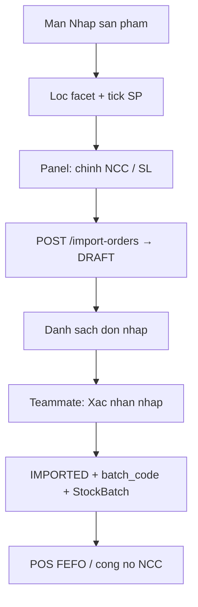

# Module Nhập hàng (theo lô)

Tài liệu tổng hợp: phân tích, luồng nghiệp vụ, edge cases, phạm vi cá nhân, seed và migration DB.

> **Tạo đơn = phiếu tạm (`DRAFT`).** **Xác nhận nhập = mới tạo lô và tăng tồn (`IMPORTED`).**  
> Màn Nhập sản phẩm chỉ giúp quyết định “nhập gì / bao nhiêu / NCC nào” — không giải thích công thức SOQ trên UI.

---

## 1. Bối cảnh & vấn đề

Hệ thống phục vụ **cửa hàng tạp hóa nhỏ**. Chủ cửa hàng cần biết nhanh hết gì / sắp hết gì / nên nhập bao nhiêu / giao NCC nào; khi hàng về mới ghi nhận tồn theo **lô** (`StockBatch` + `BatchLocation`). POS trừ tồn FEFO.

Vì vậy **lập phiếu đặt** và **nhận hàng vào kho** phải tách nhau — không tăng tồn lúc bấm “Tạo đơn”.

### Vấn đề nghiệp vụ / UX đã xử lý

| Vấn đề | Hướng xử lý |
|--------|-------------|
| Hết hàng mới nhớ nhập / nhập cảm tính | Facet + gợi ý SOQ ngầm điền SL |
| Tạo đơn lẫn “đã vào kho” | Phase DRAFT → (teammate) IMPORTED |
| UI nhiễu (kicker, Excel, “Cấu hình”, giải thích “→ gợi ý…”, tốc độ /ngày) | Cleanup màn Nhập sản phẩm: 3 vùng rõ, nhãn mức bán |

### Persona

Mở màn → lọc nhóm → tick SP → chỉnh NCC/SL → tạo phiếu tạm. Không muốn đọc công thức / thuật ngữ SOQ.

---

## 2. Luồng nghiệp vụ (2 phase)



| Phase | Màn | API | Tồn kho |
|-------|-----|-----|---------|
| 1. Lập kế hoạch | `/admin/warehouse/product-import` | `POST /import-orders` | Không đổi |
| 1b. Theo dõi | `/admin/warehouse/import` | `GET /import-orders` | Không |
| 2. Nhận hàng | (teammate) | `POST /import-orders/{id}/receive` | Tạo lô + tăng tồn |

### Phase 1 — UI

1. Chọn facet (hết bán chạy / ít bán / sắp hết / mùa / đủ / ngừng)
2. Lọc danh mục / tìm tên–SKU–barcode
3. Tick SP → `POST /suggest` → panel phải
4. Chỉnh NCC, đặt hàng, cover, số lượng
5. Xem trước (nhóm theo NCC) → **Tạo N đơn** `DRAFT`

### API Phase 1

| Method | Path | Mục đích |
|--------|------|----------|
| `GET` | `/products?facet=&categoryId=&keyword=&page=&size=` | List SP theo nhóm |
| `POST` | `/import-orders/suggest` | Gợi ý SL / NCC / cover |
| `POST` | `/import-orders` | Tạo DRAFT (gom theo `supplierId`) |
| `GET` | `/import-orders` | List + filter `orderStatus` |
| `GET` | `/import-orders/{id}` | Chi tiết |

Payload tạo đơn:

```json
{
  "lines": [
    {
      "productId": 218,
      "supplierId": 201,
      "quantity": 50,
      "costPerUnit": 6000,
      "coverDays": 7,
      "orderDate": "2026-08-05"
    }
  ]
}
```

| Field | Persist? |
|-------|----------|
| `productId`, `supplierId`, `quantity`, `costPerUnit` | Có |
| `coverDays`, `orderDate` | Không (chỉ FE / cờ urgent) |

Sau tạo: `ImportOrder` (`status=DRAFT`, `orderCode=PO-…`), `ImportOrderDetail`. **Không** tạo `StockBatch` / `BatchLocation` / `StockMovement`.

### Phase 2 — Handoff teammate

Khi hàng về: nhập SL nhận + HSD → sinh `batch_code = L + yyyyMMdd + supplierCode` (+ `-02` nếu trùng ngày) → 1 dòng detail = 1 `StockBatch` (cùng phiếu = cùng mã lô) → kệ mặc định + movement (+) → `IMPORTED`.

`POST /api/import-orders/{id}/receive` (kỳ vọng):

```json
{
  "receivedDate": "2026-08-05",
  "lines": [
    { "detailId": 101, "quantityReceived": 50, "expiryDate": "2026-08-20" }
  ]
}
```

Chỉ nhận đơn `DRAFT`. Công nợ NCC chỉ trên `IMPORTED`.

---

## 3. Tình huống & edge cases

### A. Facet / tồn

Ngưỡng BE (`ProductListService`): cửa sổ bán **14 ngày**; hết hàng → `hot` nếu `avgDaily > 0.1` else `slow`; còn hàng + `coverDaysLeft ≤ lead+1` → `warn`; `season_tag` → `season`; `inactive` → `stop`.

| # | Tình huống | Kỳ vọng UI |
|---|------------|------------|
| A1–A6 | hot/slow/warn/ok/season/stop | Đúng nhóm + nhãn mức bán |
| A7 | Đổi facet khi đã tick | Giữ selection + panel |
| A8–A9 | List rỗng / lỗi API | Empty / note đỏ |

### B. Panel / DRAFT

| # | Tình huống | Kỳ vọng |
|---|------------|---------|
| B1–B2 | Tick / bỏ tick | Suggest → panel / xóa card |
| B3–B4 | Đã có open PO | Badge + confirm |
| B5–B8 | Nhiều NCC / thiếu NCC / SL≤0 / panel trống | Validate + “Tạo N đơn” |
| B9–B11 | Cover / orderDate | Cập nhật SL / urgent (không persist date) |
| B12–B15 | Suggest fail / tạo OK–fail / đóng panel | Rollback / clear / giữ |

### C. SOQ (ẩn UI)

```
horizon = leadDays + coverDays + safety(1)
soq = ceil(max(0, avgDaily * horizon - onHand))
```

Cap theo HSD ngắn; fallback cover SP / nhóm / store. Không hiện `whyFacts` trên UI.

### D–E. Nhận hàng & tích hợp (teammate)

Nhận đúng/thiếu/thừa; HSD bắt buộc với hàng tươi; cùng phiếu cùng `batch_code`; reject nếu đã `IMPORTED` / thiếu kệ mặc định. Sau IMPORTED: facet đổi, POS FEFO, debt, badge open PO biến mất.

### F. UI cleanup (hồi quy)

Chỉ tiêu đề; không Excel/Thêm SP; “Chỉnh đơn”; cột “Mức bán” = nhãn; 3 vùng card rõ.

---

## 4. Phạm vi cá nhân vs teammate

| Đã làm (cá nhân) | Teammate / khác |
|------------------|-----------------|
| Màn Nhập sản phẩm + UI cleanup | `POST …/receive` |
| Suggest + tạo DRAFT | `batch_code` + StockBatch |
| List đơn DRAFT/IMPORTED | UI xác nhận nhập + HSD |
| Route/menu Kho hàng | POS mã lô thật |

**Checklist BE:** `ImportOrderController/Service`, `ImportSuggestionService`, `ImportOrderRepository` — suggest, create DRAFT, list, detail.

**Checklist FE:** `ProductImportPage`, `ImportPanel*`, `ProductImportTable`, `ProductFacet`, `importOrderApi`, `ImportOrderListPage`, routes/menu.

**Tuỳ chọn còn lại:** nút “Tạo phiếu nhập” trên list → link product-import; set `createdBy` khi create.

### Demo nhanh

1. Import `Database/dbDev_v1.0.sql` → bật BE (Flyway tự align schema)
2. Chạy `Database/seed_product_import_test_data.sql` (xem `Database/README_SEED_PRODUCT_IMPORT.md`)
3. Kho hàng → **Gợi ý nhập hàng** → facet hot → tick → tạo đơn
4. **Đơn nhập hàng** → thấy `DRAFT`

---

## 5. Database — chạy giống môi trường hiện tại

### Cách teammate setup

1. Tạo DB MySQL, import baseline: `Database/dbDev_v1.0.sql`
2. Cấu hình `application.properties` (URL/user/pass)
3. **Chạy BE** — Flyway **đã bật**, file `V1__align_schema_to_current_entities.sql` tự thêm/chuẩn hoá cột–bảng còn thiếu so với entity hiện tại (idempotent: chạy lại an toàn nếu cột đã có)
4. (Tuỳ chọn) seed demo nhập: `seed_product_import_test_data.sql`

Không cần chạy tay từng script migration cũ (đã gộp thành 1 file V1).

**Nếu DB từng chạy Flyway bản cũ (V2–V6 rời):** xoá bảng `flyway_schema_history` rồi restart BE để V1 chạy lại (script vẫn an toàn nhờ guard `information_schema`).

### Nội dung migration V1 (tóm tắt)

| Nhóm | Thay đổi |
|------|----------|
| Product import / SOQ | `products.status`, `season_tag`, `cover_days_override`; `categories.cover_days`, `default_supplier_id`; `store_config.default_cover_days`; `suppliers.lead_time_days` |
| Product CRUD | `products.sku` (+ unique), `brand`, `vat_percent`; `product_units.selling_price`; bảng `product_images` |
| Import order | `import_orders.status` (`DRAFT` / `IMPORTED`); normalize legacy `PENDING_CHECK` → `DRAFT`; drop cache `payment_status` / `remaining_debt` nếu còn |
| Sales order | `sales_order_details.product_unit_id`, `unit_name`; `sales_orders.paid_amount`, `due_date` |
| Stock | `stock_movements.batch_location_id` (+ FK) |

File: `BE_SEP490_G67/src/main/resources/db/migration/V1__align_schema_to_current_entities.sql`

---

## 6. Route & menu

| Path | Màn |
|------|-----|
| `/admin/warehouse/product-import` | Nhập sản phẩm (Phase 1) |
| `/admin/warehouse/import` | Danh sách đơn nhập |
| `/admin/warehouse/import-history` | Lịch sử nhập |
| `/admin/products` | Danh sách SP (Excel / Thêm SP — ngoài scope màn nhập) |

Menu **Kho hàng**: Gợi ý nhập hàng → Đơn nhập hàng → Lịch sử nhập hàng → …
